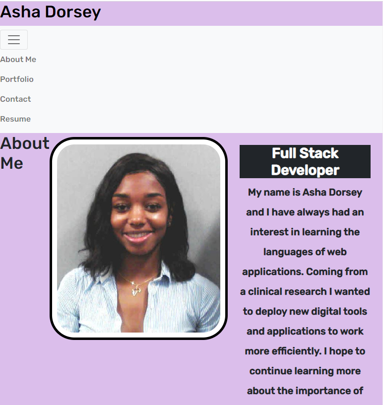
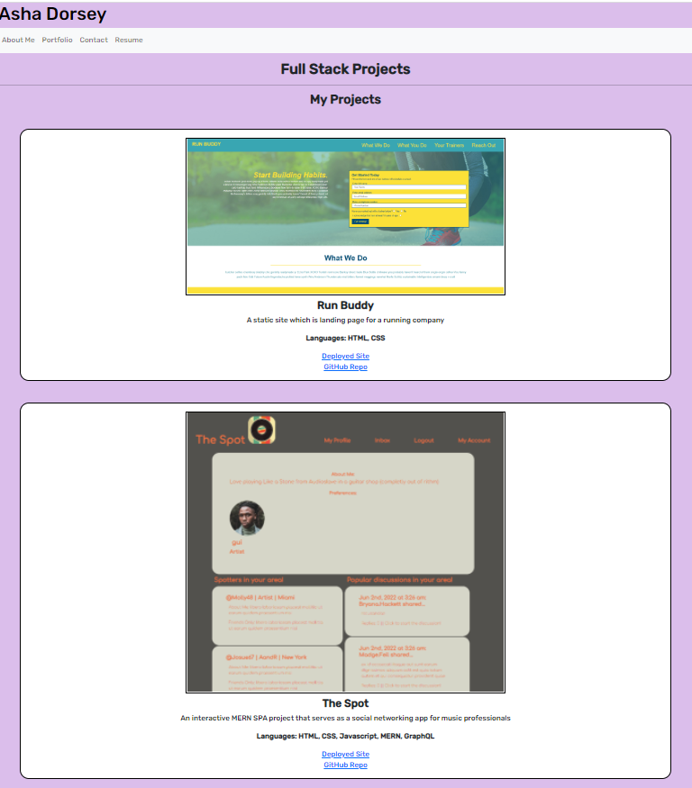

# React Portfolio

## Table of Contents

-[Description](#Description)

-[Programming Languages, Technologies/Frameworks](#Programming-Languages,-Technologies/Frameworks)

-[Installation](#Installation)

-[Contribution](#Contribution)

-[URL](#URL)

## Description

A single page application (SPA) to share my projects, resume, contact info. with future employers and fellow developers in order to collaborate on future projects.

## Programming Languages, Technologies/Frameworks

- HTML
- CSS
- Javascript
- React

## Installation

- clone/fork the repo
- run `npm i`
- run npm start

## Contribution

true

### Screenshots

### URL of the deployed application (GitHub Pages):

<https://adorsey5.github.io/react-portfolio/>

### URL of the GitHub repository:

<https://github.com/adorsey5/react-portfolio>
